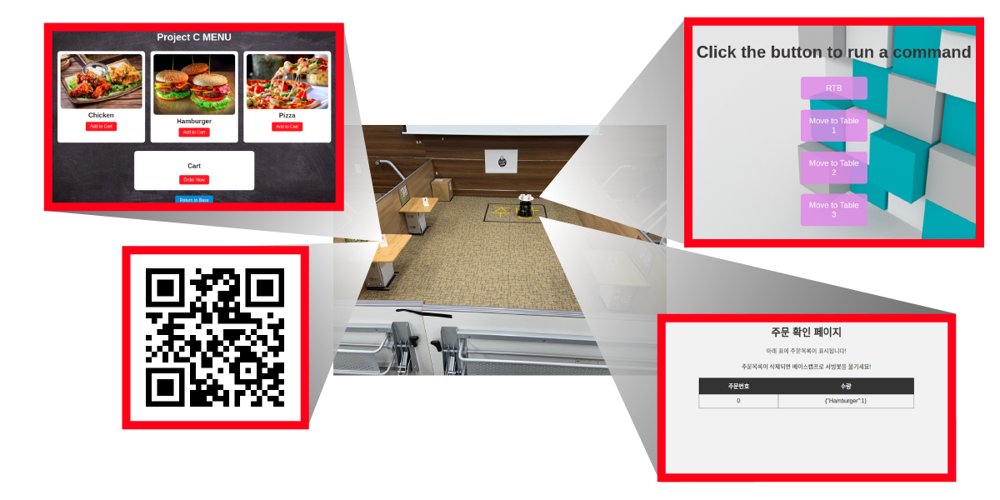
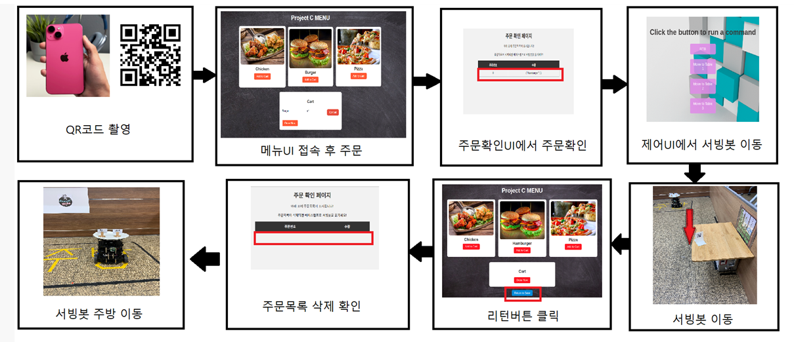

# Serving_Robot_Project

프로젝트명 : Serving Robot
 
수행기간
 2023. 10. 23 ~ 2023. 11. 24 (33일)

1) 목적 : 식당에서의 서빙인력을 로봇으로 대체
2) 개발 환경 : ROS2 / Python / Linux / Ubntu/ Node.js / javascript
3) 주요 기능
 1. SLAM을 이용하여 지도 그리기
     - ros2 catographer launch를 활용하여, Map 그림.
 2. 테이블에서 손님, 음식 선택
    - 메뉴 주문 UI 웹 구현.(주문 선택, 주문 저장 기능 구현)
    - 테이블에서 손님이 QR코드 인식을 통해, 메뉴 주문 UI로 접속
 3. 주방에서 메뉴 확인
    - 메뉴 확인 UI 웹 구현.
    - 메뉴 주문 UI에서 메뉴 Data를 전송하기 위한, 서버 구축(node.js)
 4. 주방에서 서빙 봇에 메뉴 셋팅
    - 메뉴 확인 UI 웹을 통해, 메뉴 확인 가능.
 5. 서빙 봇이 메뉴를 선택한 테이블로 이동
   - 로봇 제어 UI 웹 화면 버튼을 통해, 로봇 제어 가능
 6. 손님이 음식 픽업 후, 서빙 봇 주방으로 복귀
   - 손님이 메뉴 주문 UI 웹에서 Return 버튼을 누름 -> 메뉴 확인 UI에서 확인 가능
   - 로봇 제어 UI 웹으로 서빙 봇 복귀 명령 시행.

4.피드백

1. 소통하기 편한 팀원 좌석 배치(서로 마주보는 자리배치)
팀원 모두 PO, Developer 역할을 함께 수행
문제를 공유하고, 해결 방안을 두 개 이상 도출하여, 차선책을 동시에 구체화.
예) server↔client 통신 (get, post vs. socket)

2. Scrum 적용
최초 User Story 설정 및 product back-log 작성.
세부적인 Sprint 계획 설정으로 진행이 원활하게 수행되었음.
Sprint가 끝나면 시연을 하고, 그 결과를 feed-back 받아 increment 수행.

3. 2채널 통신 : turtlebot3 ↔ Laptop, Laptop(Server) ↔ Client
software-defind food serving system.
server ↔ client 통신 프로그램  재활용 가능 
프로그램 확장성 예) 빈대(bed-bug) 탐지 및 사진 전송

# 구성도

